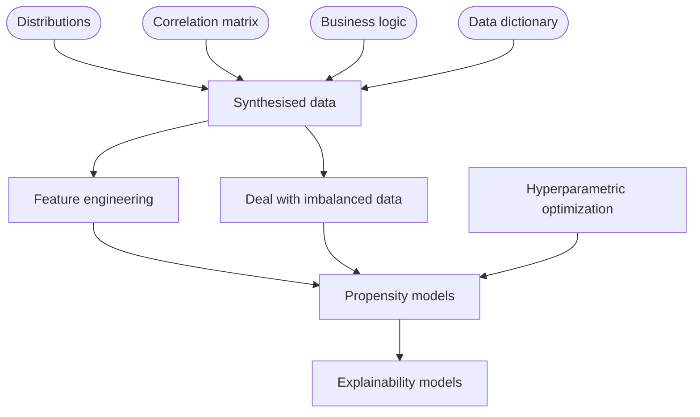

# Case cold start modeling

## **1. Case description**


### **1.1. Introduction**

This is an open-ended type of case study, where you are supposed to go through the process and not having any critical mteric values to crosschech against. So the results are going to be open for disscusions as long as you have gone though the whole case and publish it as required by the expected results section. On the other hand you could enrich the cae with own additions - for example your own business rules, other publicly available data sets, etc., as long as you publish your additions (or the way to obtain them) in the case solution. 

The case is made as a teamwork assignment as it requires diverse set of skills and several tens of hours to be solved. Some calculation time also has to be considered, as some of the operations planned in the case may be calculation extensive.


### **1.2 Case phases**

Case scheme:




*Data synthesis*

Using the provided data in form of feature distributions, correlation matrix among numerical variables, business rules, and data dictionary (for referense purposes) you must synthesise data set of at least 30000 records and at least the features described in the data dictionary. Note that you will need to synthesize about 50000+ records, before reduction by business rules to have 30000 as a final dataset. The dataset contains mainly demograpphic data where each record should represent one individual - customer of banking services. You could encode the data however you want, but have to include the description in the soution. You are most probably going to use various methods when sythesising the dataset, but you must conform (within reasonable deviations) to the limitations given by the raw data:
-  features distributions
-  corrlation matrix 
-  business rules
-  data dictionary 


*Feature engineering*

Using as many as possible feature engineering techniques, create new features, and then select the significant ones. The ones which selected, should be described in a matter similar to the data dictionary, where the  field "Derivation" formulate how you calculate it. Any additional innovative data preparation techniques are acceptable such as unsuppervised ML, spicific regrouping of data, randomized humanization, injecting sythnetic outliers, etc.


*Deal with imbalanced data*

For some (if not all) of the propensity models the dependent feature is going to be imbalanced and before modeling you will have to deal with that first. Variuos techniques are possible, as long as you get reasonable metric scores (also you may propose the metrics which work better for the case).


*Propensity models*

The models you are expected to make should return individual propensity to buy score for every individualon all four of the credit products, as follows:
- Overdraft 
- Consumer credit
- Mortgage loan
- Credit card 

When modeling for each product type use the respected binary feature as dependent feature. Also have in mind that there features for applied for the different type of credit products.

You may add suitable visualizations of the model results.

It is highly encouraged to try multiple classes of models for each dependent feature, and at least some of the finally selected models should be of black box nature (so requiring explainability modeling).

Use argumented method for validation of your choosing, but do have in mind that at least 5000 records should be separated as out-of-sample test set, and maybe another 5000 should be used as in-sample validation for various purposes (including hyperoptimization).


*Hyperparametric optimization*

For the purpose of exercising do hyperparametric optimizations on the best performing models for each product type. If you have time/hardware constraints, keep the hyper parameter grid smaller - 4-5 most important parameters should be enough. Again - you have the choice as to which technique for hyperparametric optimization to use.


*Explainability models*

Once you have the best performing models for each product type, you should apply explanability models for those of them which are black-box. Here either use a ready-made library (which would be probably easier), or use a simplistic method with decesion tree explaining the high-propensity cases with only the significant variables. In case you use a special library, describe the process of installing it in the solution (these libraries tend to have compatibility issues so making their use replicable is helpful).


### **1.3. Expected results**

The format of the solution has to be a single ".ipynb" file, with all documentation, explanations, needed outputs, visualizations, etc. included in their respectable places. You could use any programing language which runs in this environment to solve the case.

Upload your solutions [here...](https://github.com/Marchev-Science/case-cold-start-modeling/upload/main/uploads)


## **2. Case data**

### **2.1 Features distributions**

These are the distributions of the non-numeric features with their respective labels:

```python
dists = {
    'sex':{'labels':['M', 'F'], 'values':[0.4854368932,0.5145631068]},
    'lv_educ':{'labels':['Incomplete', 'Primary', 'Basic', 'Secondary', 'Higher'], 'values':[0.0595,0.07788016474,0.2309254283,0.4359496722,0.1957067711]},
    'empl_stat':{'labels':['Employers', 'Self-employed', 'Employed in private sector', 'Employed in public sector', 'Unpaid family workers'], 'values':[0.03631598652,0.07272557095,0.6708785723,0.2126544365,0.00742543367]},
    'marit_stat':{'labels':['Single', 'Married', 'Divorced', 'Widowed'], 'values':[0.397,0.443,0.058,0.102]},
    'house_memb':{'labels':['1', '2', '3', '4', '5', '6', '7+'], 'values':[0.1805,0.3778,0.2387,0.1157,0.0525,0.0238,0.011]},
    'chil_u_18_y':{'labels':['No children under 18', 'One child under 18', 'Two children under 18', 'Three children under 18', 'Four children under 18', 'Five children under 18', 'Six or more children under 18'], 'values':[0.422602157,0.36552047,0.183222339,0.020674764,0.004993779,0.001875149,0.001111341]},
    'nation':{'labels':['Bulgaria', 'EU', 'Other'], 'values':[0.9950198043,0.001146570676,0.003833625045]},
    'religion':{'labels':['Protestant', 'Catholic', 'Orthodox', 'Muslim', 'Other', 'No religion', 'I do not identify myself'], 'values':[0.011,0.008,0.76,0.1,0.002,0.047,0.072]},
    'soc_econ_stat':{'labels':['Economically active', 'Economically inactive'], 'values':[0.6151643031,0.3848356969]},
    'prof_ind':{'labels':['Agriculture, forestry and fisheries', 'Mining and processing industry', 'Utilities (electricity distribution and water supply)', 'Construction', 'Trade, automobile and motorcycle repair', 'Transportation, warehousing and mail', 'Hospitality and restaurant services', 'Creation and distribution of information and creative products', 'Telecommunications', 'Financial and administrative activities', 'Public administration', 'Education and research', 'Human health and social work', 'Other activities'], 'values':[0.03090815115,0.2353,0.029,0.05523651408,0.1645618594,0.06439111505,0.05161626582,0.03936261795,0.07356911161,0.04836124844,0.104946474,0.06006423384,0.04269692032]},
    'prof_stat':{'labels':['Management contract', 'Employment contract', 'Civil contract', 'Self-employed', 'Unemployed', 'Pensioner'], 'values':[0.01783393631,0.4732428049,0.02497602302,0.0385148509,0.167699009,0.277733376]},
    'count_house':{'labels':['0', '1', '2+'], 'values':[0.37,0.6,0.03]},
    'own_field':{'labels':['YES', 'NO'], 'values':[0.184481059,0.2621335023,0.5533854387]},
    'num_car_house':{'labels':['0', '1', '2', '3+'], 'values':[0.5714285714,0.36,0.06428571429,0.004285714286]},
    'own_rent_house':{'labels':['my own', 'rented'], 'values':[0.843,0.157]},
    'edu':{'labels':['Educational Sciences', 'Humanities', 'Social, Economic and Legal Sciences', 'Natural Sciences, Mathematics and Informatics', 'Technical Sciences', 'Agricultural Sciences and Veterinary Medicine', 'Health and Sports', 'Arts', 'Security and Defense'], 'values':[0.07591254907,0.0461889827,0.5266633332,0.04571641724,0.1533297557,0.01776640163,0.0930038303,0.02247374859,0.01891291637]},
    'temp':{'labels':['Choleric', 'Phlegmatic', 'Sanguine', 'Melancholic'], 'values':[0.38,0.11,0.23,0.28]},
    'invest_exp':{'labels':['0', '1-5', '6-10', '11-15', '16-25'], 'values':[0.7,0.2,0.06,0.03,0.01]},
    'shares':{'labels':['YES', 'NO'], 'values':[0.003394353314,0.9966056467]},
    'corp_oblig':{'labels':['YES', 'NO'], 'values':[0.0003792213936,0.9996207786]},
    'oth':{'labels':['YES', 'NO'], 'values':[0.000592597502012084,0.999407402497988]},
    'inv_fund':{'labels':['YES', 'NO'], 'values':[0.06491199709,0.9350880029]},
    'cash':{'labels':['YES', 'NO'], 'values':[0.04105169923,0.9589483008]},
    'crypto':{'labels':['YES', 'NO'], 'values':[0.003284135938,0.9967158641]},
    'gov_bond':{'labels':['YES', 'NO'], 'values':[0.06835666691,0.9316433331]},
    'deposits':{'labels':['YES', 'NO'], 'values':[0.8180293286,0.1819706714]},
    'banking':{'labels':['Online', 'Offline'], 'values':[0.09,0.91]},
    'bk_oprat':{'labels':['Up to 7', 'From 8 to 10', 'From 11 to 13', 'From 14 to 18', 'From 19 to more'], 'values':[0.0084,0.2424,0.4729,0.2615,0.0148]},
    'bk_dc':{'labels':['Under one', 'One', 'Two', 'Three'], 'values':[0.01,0.57,0.38,0.04]},
    'bk_cc':{'labels':['YES', 'NO'], 'values':[0.17,0.83]},
    'bk_acc':{'labels':['YES', 'NO'], 'values':[0.8634087377,0.1365912623]},
    'ins_prop':{'labels':['YES', 'NO'], 'values':[0.05,0.95]},
    'ins_life':{'labels':['YES', 'NO'], 'values':[0.09,0.91]},
    'ins_casco':{'labels':['YES', 'NO'], 'values':[0.03,0.97]},
    'health_ins':{'labels':['YES', 'NO'], 'values':[0.02,0.98]},
    'overdraft':{'labels':['YES', 'NO'], 'values':[0.19,0.81]},
    'cons_cred':{'labels':['YES', 'NO'], 'values':[0.26,0.74]},
    'mortgage':{'labels':['YES', 'NO'], 'values':[0.02,0.98]},
    'car_leas':{'labels':['YES', 'NO'], 'values':[0.2,0.8]},
    'pens_ins':{'labels':['YES', 'NO'], 'values':[0.11,0.89]},
    'overdraft_app':{'labels':['YES', 'NO'], 'values':[0.2439,0.7561]},
    'cons_cred_app':{'labels':['YES', 'NO'], 'values':[0.305299502487562,0.694700497512438]},
    'mortgage_app':{'labels':['YES', 'NO'], 'values':[0.03,0.97]},
    'bk_cc_app':{'labels':['YES', 'NO'], 'values':[0.21,0.79]}
}
```

### **2.2 Correlation matrix**

The following data is the Pearson correlation matrix among the numerical features. You could safely assume normal (or close to normal) distribution for all of those features.

```python
corr = {
    'features': ['age', 'ind_risk', 'income', 'pers_exp', 'house_exp', 'taxes', 'transp_telecom', 'hobby'],
    'age': [1, -0.00665947056405372, 0.00291644965339247, 0.0107779942638097, 0.00698674581731255, 0.00729153655132963, 0.0099866509330216, 0.00931630696561133],
    'ind_risk': [-0.00665947056405372, 1, 0.0039918072709289, 0.00806259039194059, 0.00457023635440603, 0.0061985340641631, 0.00768699810849585, -0.00332322616613201],
    'income': [0.00291644965339247, 0.0039918072709289, 1, 0.560949334881676, 0.58892666343229, 0.581907424628933, 0.562946509689962, 0.352350802339294],
    'pers_exp': [0.0107779942638097, 0.00806259039194059, 0.560949334881676, 1, 0.928449923861951, 0.929598634668897, 0.934775947642248, 0.714298364869941],
    'house_exp': [0.00698674581731255, 0.00457023635440603, 0.58892666343229, 0.928449923861951, 1, 0.93031279279417, 0.927846735467478, 0.679286362990223],
    'taxes': [0.00729153655132963, 0.0061985340641631, 0.581907424628933, 0.929598634668897, 0.93031279279417, 1, 0.92920510128812, 0.689442053350162],
    'transp_telecom': [0.0099866509330216, 0.00768699810849585, 0.562946509689962, 0.934775947642248, 0.927846735467478, 0.92920510128812, 1, 0.714114127908189],
    'hobby': [0.00931630696561133, -0.00332322616613201, 0.352350802339294, 0.714298364869941, 0.679286362990223, 0.689442053350162, 0.714114127908189, 1]
}
```

### **2.3 Business rules**

These are the given business rules (you could expand the list if you see fit):

 | id | Independent feature | Independent feature value | Dependent feature | Dependent feature value filter | Note | 
 | --- | --- | --- | --- | --- | --- |
 | 1 | Marital status | Married | Number of household members | >2 | The number of household members in family households is more likely to be reater than 2 | 
 | 2 | Profession - Industry | Financial and administrative activities | Previous investment experience in years | >0 | They are more likely to own a bank account | 
 | 3 | Age - completed years | <25 | Previous investment experience in years | 0 | Under 24s are less likely to have investment experience. Between 35-44 and 45-54 are more likely to have extensive investment experience | 
 | 4 | Age - completed years | <25 | Level of education | <Higher | Under 24s are less likely to have a college degree | 
 | 5 | Age - completed years | <25 | Number of children under 18 years | <2 | From 20-24, it is less likely to have more than 1 child under 18 | 
 | 6 | Previous investment experience in years | >0 | Investment experience with bank deposits | Y | They are more likely to own a bank account | 
 | 7 | Investment in stocks | Y | Previous investment experience in years | >0 | Previous investment experience in years | 
 | 8 | Investment in bonds | Y | Previous investment experience in years | >0 | Previous investment experience in years | 
 | 9 | Other investments | Y | Previous investment experience in years | >0 | Previous investment experience in years | 
 | 10 | Investment in a fund | Y | Previous investment experience in years | >0 | Previous investment experience in years | 
 | 11 | Currency investments | Y | Previous investment experience in years | >0 | Previous investment experience in years | 
 | 12 | Investing in crypto currencies | Y | Previous investment experience in years | >0 | Previous investment experience in years | 
 | 13 | Investment in government securities | Y | Previous investment experience in years | >0 | Previous investment experience in years | 
 | 14 | Age - completed years | <25 | Bank account | N | Under 24s are less likely to have a checking account | 
 | 15 | Age - completed years | <18 | Bank account | N | Under 18 is not possible to have a current account | 
 | 16 | Level of education | Higher | Income | >27601 | A higher level of education implies earnings in the upper range | 
 | 17 | Number of children under 18 years | >1 | Number of household members | >3 | The number of household members is directly dependent on the number of children under 18. age | 
 | 18 | Level of education | Higher | Socio-economic status | Economically active | A higher level of education implies an economically active status | 
 | 19 | Income | >27601 | Taxes and insurance | >2500 | Earnings in the upper range, correspond to higher taxes and insurance | 


### **2.4 Data Dictionary**

| Number | Factor | Code | Variable type | Possible values |  Derivation |
| --- | --- | --- | --- | --- |  --- |
| 1 | gender | sex | Binary	 | M; F | simulation |
| 2 | Age - completed years | age | Continuous | 20 - 85 | correlation |
| 3 | Level of education | lv_educ | Ordinal | Incomplete; Primary; Basic; Secondary; Higher | simulation |
| 4 | Employment status | empl_stat | Ordinal | Employers; Self-employed; Employed in private sector; Employed in public sector; Unpaid family workers | simulation |
| 5 | Marital status | marit_stat | Ordinal | Single; Married; Divorced; Widowed | simulation |
| 6 | Number of household members | house_memb | Interval | 1; 2; 3; 4; 5; 6; 7+ | simulation |
| 7 | Number of children under 18 years | chil_u_18_y | Interval | No children under 18; One child under 18; Two children under 18; Three children under 18; Four children under 18; Five children under 18; Six or more children under 18 | simulation |
| 8 | Nationality | nation | Nominal | Bulgaria; EU; Other | simulation |
| 9 | Religion | religion | Nominal | Protestant; Catholic; Orthodox; Muslim; Other; No religion; I do not identify myself | simulation |
| 10 | Socio-economic status | soc_econ_stat | Nominal | Economically active; Economically inactive | simulation |
| 11 | Profession - Industry | prof_ind | Nominal | Agriculture, forestry and fisheries; Mining and processing industry; Utilities (electricity distribution and water supply); Construction; Trade, automobile and motorcycle repair; Transportation, warehousing and mail; Hospitality and restaurant services; Creation and distribution of information and creative products; Telecommunications; Financial and administrative activities; Public administration; Education and research; Human health and social work; Other activities | simulation |
| 12 | Professional status | prof_stat | Nominal | Management contract; Employment contract; Civil contract; Self-employed; Unemployed; Pensioner | 
| 13 | Number of owned apartments/houses | count_house | Interval | 0; 1; 2+ | simulation |
| 14 | Land ownership | own_field | Nominal | YES; NO | simulation |
| 15 | Cars per household | num_car_house | Interval | 0; 1; 2; 3+ | simulation |
| 16 | The place I live in is | own_rent_house | Binary | my own; rented | simulation |
| 17 | Education | edu | Nominal | Educational Sciences; Humanities; Social, Economic and Legal Sciences; Natural Sciences, Mathematics and Informatics; Technical Sciences; Agricultural Sciences and Veterinary Medicine; Health and Sports; Arts; Security and Defense | simulation |
| 18 | Temperament | temp | Nominal | Choleric; Phlegmatic; Sanguine; Melancholic | simulation |
| 19 | Individual risk preference | ind_risk | Continuous | 0 - 1 | correlation |
| 20 | Previous investment experience in years | invest_exp | Interval | 0; 1-5; 6-10; 11-15; 16-25 | simulation |
| 21 | Investment experience with shares | shares | Binary | YES; NO | simulation |
| 22 | Investment experience with bonds | corp_oblig | Binary | YES; NO | simulation |
| 23 | Investment experience with others | oth | Binary | YES; NO | simulation |
| 24 | Investment experience with investment funds | inv_fund | Binary | YES; NO | simulation |
| 25 | Investment experience with currencies | cash | Binary | YES; NO | simulation |
| 26 | Investment experience with cryptocurrencies | crypto | Binary | YES; NO | simulation |
| 27 | Investment experience with government securities | gov_bond | Binary | YES; NO | simulation |
| 28 | Investment experience with bank deposits | deposits | Binary | YES; NO | simulation |
| 29 | Income | income | Countinuous | Up to 6121; Up to 12001; Up to 27601; Up to 43201; Up to 58801; Up to 74401; Over 90001+ | correlation |
| 30 | Personal expenses | pers_exp | Continuous | up to 4500; up to 5000; up to 5500; up to 6000 | correlation |
| 31 | Housing costs | house_exp | Continuous | up to 500; up to 1500; up to 3000; up to 4000 | correlation |
| 32 | Taxes and insurance | taxes | Continuous | up to 500; up to 1000; up to 2000; up to 2500 | correlation |
| 33 | Transport and communications | transp_telecom | Continuous | up to 500; up to 1000; up to 1500; up to 2500 | correlation |
| 34 | Leisure and hobby | hobby | Continuous | 0; up to 1500; up to 2000; up to 3000 | correlation |
| 35 | Preferred method of banking | banking | Binary | Online; Offline | simulation |
| 36 | Average number of bank transactions | bk_oprat | Proportional | Up to 7; From 8 to 10; From 11 to 13; From 14 to 18; From 19 to more | simulation |
| 37 | Debit card | bk_dc | Ordinal | Under one; One; Two; Three | simulation |
| 38 | Credit card | bk_cc | Binary | YES; NO | simulation |
| 39 | Bank account | bk_acc | Binary | YES; NO | simulation |
| 40 | Property insurance | ins_prop | Binary | YES; NO | simulation |
| 41 | Insurance - life | ins_life | Binary | YES; NO | simulation |
| 42 | Insurance - Motor Vehicle | ins_casco | Binary | YES; NO | simulation |
| 43 | Additional health insurance | health_ins | Binary | YES; NO | simulation |
| 44 | Overdraft | overdraft | Binary | YES; NO | simulation |
| 45 | Consumer credit | cons_cred | Binary | YES; NO | simulation |
| 46 | Mortgage | mortgage | Binary | YES; NO | simulation |
| 47 | Car lease/loan | car_leas | Binary | YES; NO | simulation |
| 48 | Additional pension insurance - 3rd pillar | pens_ins | Binary | YES; NO | simulation |
| 50 | Overdraft - applied | overdraft_app | Binary | YES; NO | simulation |
| 51 | Consumer credit - applied | cons_cred_app | Binary | YES; NO | simulation |
| 52 | Mortgage loan - applied | mortgage_app | Binary | YES; NO | simulation |
| 53 | Credit card - applied | bk_cc_app | Binary | YES; NO | simulation |


## **3. Toolbox**

Here are some useful tools to work with the data

### **3.1. Extract distributions from the dictionary**

```python
def extract_dists(x,dists):
    '''
    A function to extract distributions from the dictionary dists,where:
    x is the name of the feature to extract in ''
    dists is the dictionary with all distributions
    '''
    import pandas as pd
    column_names = dists[x]['labels']
    values = [dists[x]['values']]
    pd_df = pd.DataFrame(data=values, columns=column_names)
    pd_df.index = pd.Index([x])
    return pd_df
```

### **3.2. Convert the dictionary with correlation matrix to dataframe**

```python
def corr2df(corr):
    '''
    A function to create correlation dataframe from dictionary corr, where
    corr is the dictionary with the correlation matrix
    '''
    import pandas as df
    corr_df = pd.DataFrame(corr)
    corr_df.set_index('features', inplace=True)
    corr_df.index.name=None
    return corr_df
```

